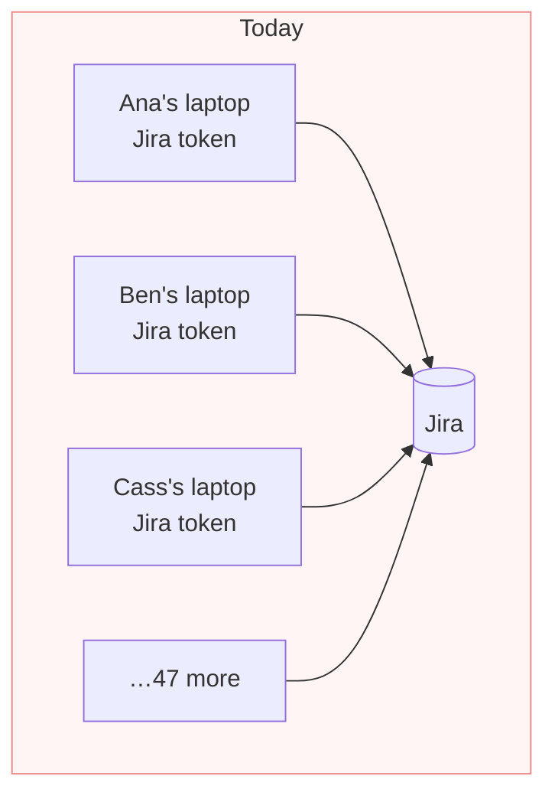
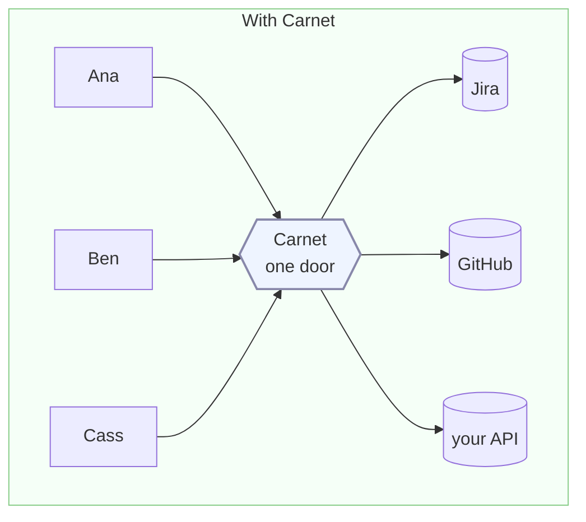
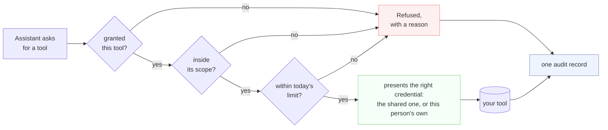

# carnet

[](https://github.com/carnet-mcp/carnet/actions/workflows/tests.yml)
[](LICENSE)

**One safe door between your team's AI assistants and your company's tools.**

## The problem

Your engineers use assistants like Claude Code or Cursor. To let one read your Jira or
open a pull request, each person installs a connector on their own laptop and pastes in
their own API token.

That token now sits on a laptop. Nobody knows it exists, nobody can take it back, and
nothing records what it did.



Fifty people means fifty credentials you did not issue, cannot revoke and cannot audit.
When somebody leaves, their token keeps working.

## What Carnet does

Carnet puts one endpoint in the middle. Everyone points their assistant at it instead.
The credential lives in Carnet, not on the laptop.



Now you can answer the questions you could not answer before: **who can reach what**,
**what did they actually do**, and **how do I turn this off for one person** — without
touching anybody's machine.

**It does not run agents.** The assistant is still theirs and still runs where it always
did. Carnet only handles the tool calls it makes.

## What happens on a single call

Every call takes the same path, and every one of them is written down.



A refusal is an answer the assistant can read and explain, not a crash. And it is
recorded, so *somebody tried to reach a project they should not* is a question with an
answer.

## What your team gets

**Control**
- Approve tools one at a time. Adding a server approves nothing by itself.
- Limit each tool to specific projects, repositories or accounts.
- Mark each tool read-only or allowed-to-write, and grant them separately.

**Identity**
- Each person's calls can go out as **their own account**, not a shared one. They connect
  it themselves, in a browser, and you never hold their password or token.
- Or use one company account for a tool, if that is what you want.

**Off-boarding**
- One command cuts somebody off. Their access stops at their next call, on every device,
  with nothing to uninstall.

**Visibility**
- Every call is one record: who, which tool, which arguments, allowed or refused, and how
  long it took.
- A dashboard over the last month, and one JSON line per call to whatever already reads
  your logs.

**Cost**
- Daily ceilings per person on calls, on tokens and in dollars.
- Ask *would this be allowed* before anything runs.

The complete list, down to every flag and setting, is
[docs/CAPABILITIES.md](docs/CAPABILITIES.md).

## Who it is for

| You are | Start with |
| --- | --- |
| One developer wanting your own tools behind one endpoint | the file below, five minutes, no database |
| A small team sharing a few company accounts | the file below, then the platform when you want per-person identity |
| A company where each person's access must be their own, and audited | the platform below |

---

# Running it

Everything above is what it does. Everything below is how to run it.

## A file and `docker run`

No database, no sign-in, no browser. One `carnet.yaml` is the whole configuration. Every
secret is a `${VARIABLE}` pointer into the environment — a literal is refused — so the
file is safe to commit.

```bash
cp carnet.example.yaml carnet.yaml       # edit: your servers, your tools
carnet --new-token                       # prints a token once; put it in a variable
export CARNET_TOKEN_LAPTOP=art_m_…       # the variable carnet.yaml names
export JIRA_TOKEN=…                      # the credential the door presents to Jira

docker run --rm -p 8000:8000 \
  -v ./carnet.yaml:/carnet.yaml -e CARNET_FILE=/carnet.yaml \
  -e JIRA_TOKEN -e CARNET_TOKEN_LAPTOP \
  ghcr.io/carnet-mcp/carnet
```

Give your assistant `http://localhost:8000/mcp` with `Authorization: Bearer <the token>`
— Claude Code, Cursor, anything that takes a header. `tools/list` returns exactly what
that token is granted; ask for anything else and the call is refused with a reason.

Three commands worth knowing:

```bash
carnet --check-file carnet.yaml    # validate it; every refusal names the key
carnet --discover jira             # dial a server, print the tools: block to paste
carnet --new-token                 # mint a token, offline, no database
```

A server on your own machine needs one more line, because the door refuses plain HTTP and
private addresses unless you say so:
`-e CARNET_EGRESS_INTERNAL_HOSTS=host.docker.internal`.

Until the first image is published, build it from the checkout:

```bash
docker build -t ghcr.io/carnet-mcp/carnet --target api -f deploy/Dockerfile .
```

## The whole product, one machine

The file above speaks for one shared account per server. This is the other shape: the
same image with a database, where people sign in and connect their own accounts.

```bash
cd backend
pip install -e ".[dev,postgres,access]"

carnet --local            # then open the URL it prints
```

That starts Postgres, the API, the built frontend and a local email-and-password identity
provider. The first account you create becomes the administrator. The provider is a real
OIDC provider running on your machine — the API verifies its tokens with the same code
and the same checks it would use on Okta, so it is not a bypass. State lives in
`var/local/`. An enterprise identity provider is one `carnet --add-idp` away.

For a real deployment, `deploy/` holds a compose stack with TLS, a front door, and a
migration step that runs before the API starts. See [deploy/README.md](deploy/README.md).

## A client that speaks OAuth

Claude Desktop, Claude.ai and Cursor connect with the URL alone. The door serves the
discovery documents, registers the client, sends the person to sign in with the provider
they already have, and mints the token at the end. Nothing is pasted.

## Where to go next

| Document | What it is for |
| --- | --- |
| [docs/PREMISE.md](docs/PREMISE.md) | what Carnet is and is not. Outranks everything else here |
| [docs/CAPABILITIES.md](docs/CAPABILITIES.md) | the complete surface: flags, routes, file keys, settings, screens |
| [docs/GUIDE.md](docs/GUIDE.md) | reaching your own server, credentials you do not hold, brokering a model |
| [docs/API.md](docs/API.md) | the HTTP API, and the reasoning behind it |
| [docs/DESIGN.md](docs/DESIGN.md) | why it is shaped this way: layering, tenancy, permissions, the audit log |
| [docs/LIMITS.md](docs/LIMITS.md) | what is not done, and what is known to be wrong |
| [docs/UPGRADING.md](docs/UPGRADING.md) | what an upgrade preserves, and how far back it works from |
| [docs/runbooks/](docs/runbooks/) | offboarding, key rotation and tenant deletion, each run at least once |

## Contributing

Read [CONTRIBUTING.md](CONTRIBUTING.md), and the [code of conduct](CODE_OF_CONDUCT.md)
that goes with it. Every commit needs a [DCO](DCO) sign-off (`git commit -s`); there is
no CLA. The gates are `pytest`, `ruff`, `mypy` and the frontend build, and every one of
them runs locally with no secrets and no network.

Security issues go through GitHub's private vulnerability reporting rather than a public
issue — see [SECURITY.md](SECURITY.md).

What changed between releases is in the [changelog](CHANGELOG.md); what an upgrade
preserves is in [docs/UPGRADING.md](docs/UPGRADING.md).

## Licence

Apache-2.0. See [LICENSE](LICENSE) and [NOTICE](NOTICE).
