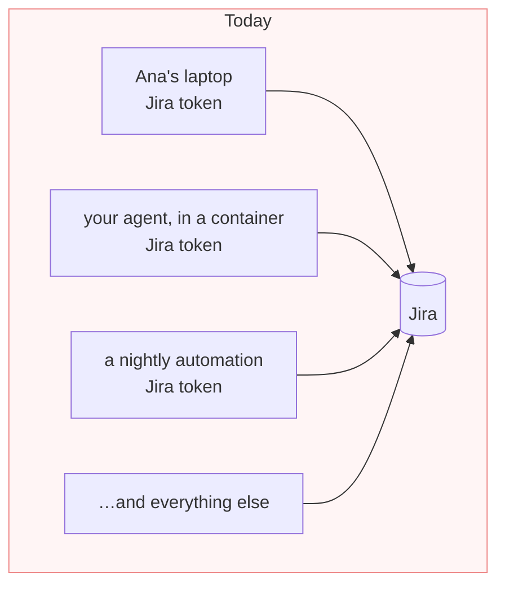
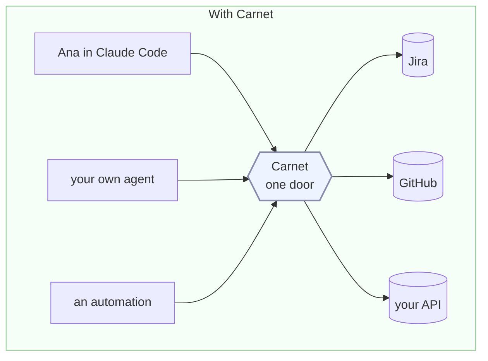
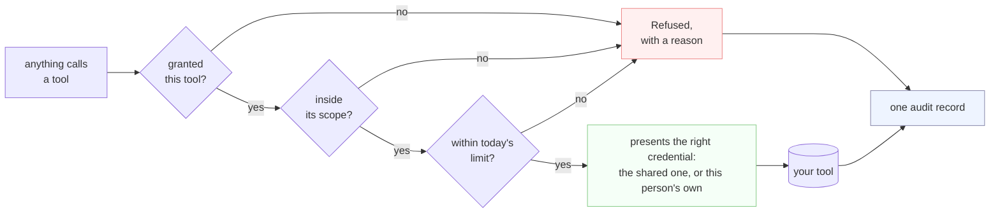

# carnet

[](https://github.com/carnet-mcp/carnet/actions/workflows/tests.yml)
[](LICENSE)

**One safe door between everything AI in your company and the tools it reaches.**

## The problem

Things in your company now call tools on their own. A coding assistant like Claude Code
or Cursor. An agent your team built. A workflow in n8n or LangChain. A script with an
LLM in the middle. Anything that speaks MCP, and increasingly everything does.

To let one read your Jira or open a pull request, somebody installs a connector and
pastes in an API token — on a laptop, in a container, in a CI secret.

That token now sits somewhere nobody tracks. Nobody knows it exists, nobody can take it
back, and nothing records what it did.



Fifty people means fifty credentials you did not issue, cannot revoke and cannot audit.
When somebody leaves, their token keeps working.

## What Carnet does

Carnet puts one endpoint in the middle. Every assistant, agent and automation points at
it instead of at the tool. The credential lives in Carnet, not wherever the thing is
running.



Now you can answer the questions you could not answer before: **who can reach what**,
**what did they actually do**, and **how do I turn this off for one person** — without
touching anybody's machine.

**It does not run your agents.** They stay where they are — a laptop, your cluster, a
vendor's cloud. Carnet only handles the tool calls they make, which is why it works the
same for a coding assistant you did not build and an agent you did.

## What happens on a single call

Every call takes the same path, and every one of them is written down.



A refusal is an answer the caller can read and explain, not a crash. And it is recorded,
so *what tried to reach a project it should not* is a question with an answer — whether
the caller was a person's assistant or an unattended agent at 3am.

## What your team gets

**Control**
- Approve tools one at a time. Adding a server approves nothing by itself.
- Limit each tool to specific projects, repositories or accounts.
- Mark each tool read-only or allowed-to-write, and grant them separately.

**Identity**
- Each person's calls can go out as **their own account**, not a shared one. They connect
  it themselves, in a browser, and you never hold their password or token.
- Or use one company account for a tool, if that is what you want.
- Unattended agents get their own token with their own scope, so a service is not
  indistinguishable from the person who deployed it.

**Off-boarding**
- One command cuts somebody off. Their access stops at their next call, on every device,
  with nothing to uninstall.

**Visibility**
- Every call is one record: who, which tool, which arguments, allowed or refused, and how
  long it took.
- A dashboard over the last month, and one JSON line per call to whatever already reads
  your logs.

**Cost**
- Daily ceilings per person on calls, on tokens and in dollars.
- Ask *would this be allowed* before anything runs.

The complete list, down to every flag and setting, is
[docs/CAPABILITIES.md](docs/CAPABILITIES.md).

## Who it is for

| You are | Start with |
| --- | --- |
| One developer putting your own tools behind one endpoint | the file below, five minutes, no database |
| A team shipping agents that need company credentials | the file below, one token per agent, scoped |
| A company where each person's access must be their own, and audited | the platform below |

---

# Running it

Everything above is what it does. Everything below is how to run it.

## A file and `docker run`

**You need Docker and nothing else.** No clone, no Python, no database, no sign-in.
Copy all four lines:

```bash
curl -O https://raw.githubusercontent.com/carnet-mcp/carnet/main/carnet.example.yaml
mv carnet.example.yaml carnet.yaml
export CARNET_TOKEN_LAPTOP=$(docker run --rm ghcr.io/carnet-mcp/carnet carnet --new-token)
export JIRA_TOKEN=… WEATHER_KEY=…        # whatever your carnet.yaml points at

docker run --rm -p 8000:8000 \
  -v ./carnet.yaml:/carnet.yaml -e CARNET_FILE=/carnet.yaml \
  -e JIRA_TOKEN -e WEATHER_KEY -e CARNET_TOKEN_LAPTOP \
  ghcr.io/carnet-mcp/carnet
```

That file is the whole configuration: the servers you front, the tools you expose from
each, the permission lists that bound them, and the tokens that may call them. Every
secret is a `${VARIABLE}` pointer into the environment — a literal is refused — so the
file is safe to commit. Edit it to point at your own servers.

Then point anything at `http://localhost:8000/mcp` with
`Authorization: Bearer $CARNET_TOKEN_LAPTOP` — Claude Code, Cursor, an agent framework,
your own code, anything that speaks MCP and can send a header. `tools/list` returns
exactly what that token is granted; ask for anything else and the call is refused with a
reason.

Three more commands, all of which run in the image with no install:

```bash
docker run --rm -v ./carnet.yaml:/f.yaml ghcr.io/carnet-mcp/carnet \
  carnet --check-file /f.yaml        # validate it; every refusal names the key

docker run --rm -e CARNET_FILE=/f.yaml -v ./carnet.yaml:/f.yaml \
  ghcr.io/carnet-mcp/carnet carnet --discover jira   # print the tools: block to paste

docker run --rm ghcr.io/carnet-mcp/carnet carnet --new-token   # another token
```

A server on your own machine needs one more line, because the door refuses plain HTTP and
private addresses unless you say so:
`-e CARNET_EGRESS_INTERNAL_HOSTS=host.docker.internal`.

<details>
<summary>Verifying the image, or building it yourself</summary>

Every published image is signed with cosign, keyless, by the release workflow in this
repository:

```bash
cosign verify ghcr.io/carnet-mcp/carnet:latest \
  --certificate-identity-regexp '^https://github.com/carnet-mcp/carnet/' \
  --certificate-oidc-issuer https://token.actions.githubusercontent.com
```

Or build it from a checkout:

```bash
docker build -t carnet --target api -f deploy/Dockerfile .
```
</details>

## The whole product, one machine

The file above speaks for one shared account per server. This is the other shape: the
same image with a database, where people sign in and connect their own accounts.

```bash
cd backend
pip install -e ".[dev,postgres,access]"

carnet --local            # then open the URL it prints
```

That starts Postgres, the API, the built frontend and a local email-and-password identity
provider. The first account you create becomes the administrator. The provider is a real
OIDC provider running on your machine — the API verifies its tokens with the same code
and the same checks it would use on Okta, so it is not a bypass. State lives in
`var/local/`. An enterprise identity provider is one `carnet --add-idp` away.

For a real deployment, `deploy/` holds a compose stack with TLS, a front door, and a
migration step that runs before the API starts. See [deploy/README.md](deploy/README.md).

## A client that speaks OAuth

Claude Desktop, Claude.ai and Cursor connect with the URL alone. The door serves the
discovery documents, registers the client, sends the person to sign in with the provider
they already have, and mints the token at the end. Nothing is pasted.

## Where to go next

| Document | What it is for |
| --- | --- |
| [docs/PREMISE.md](docs/PREMISE.md) | what Carnet is and is not. Outranks everything else here |
| [docs/CAPABILITIES.md](docs/CAPABILITIES.md) | the complete surface: flags, routes, file keys, settings, screens |
| [docs/GUIDE.md](docs/GUIDE.md) | reaching your own server, credentials you do not hold, brokering a model |
| [docs/API.md](docs/API.md) | the HTTP API, and the reasoning behind it |
| [docs/DESIGN.md](docs/DESIGN.md) | why it is shaped this way: layering, tenancy, permissions, the audit log |
| [docs/UPGRADING.md](docs/UPGRADING.md) | what an upgrade preserves, and how far back it works from |
| [docs/runbooks/](docs/runbooks/) | offboarding, key rotation and tenant deletion, each run at least once |

## Contributing

Read [CONTRIBUTING.md](CONTRIBUTING.md), and the [code of conduct](CODE_OF_CONDUCT.md)
that goes with it. Every commit needs a [DCO](DCO) sign-off (`git commit -s`); there is
no CLA. The gates are `pytest`, `ruff`, `mypy` and the frontend build, and every one of
them runs locally with no secrets and no network.

Security issues go through GitHub's private vulnerability reporting rather than a public
issue — see [SECURITY.md](SECURITY.md).

What changed between releases is in the [changelog](CHANGELOG.md); what an upgrade
preserves is in [docs/UPGRADING.md](docs/UPGRADING.md).

## Licence

Apache-2.0. See [LICENSE](LICENSE) and [NOTICE](NOTICE).
